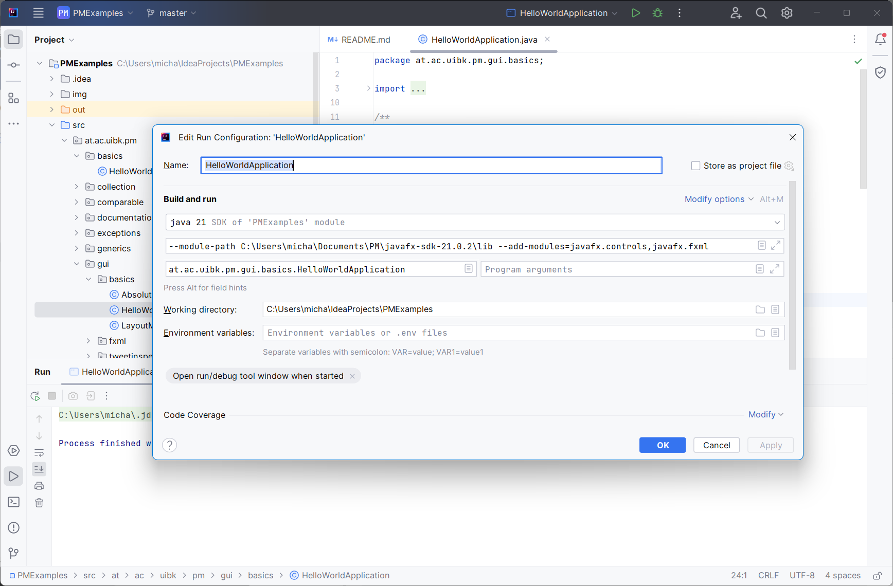

# JavaFX

### Run JavaFX application

In order to run the JavaFX examples, the JavaFX libraries first need to be added (see [setup.md](setup.md))

Additional, to run the example additional arguments need to be added to the run configuration.

1. Select a JavaFX example (e.g. `HelloWorldApplication` in the `gui.basics` package). 
2. Select the `main` method right-click an select `More Run/Debug -> Modify Run Configuration`.
3. Select `Modify Options -> Add VM options`
4. Add `--module-path path/to/javafx --add-modules=javafx.controls,javafx.fxml` to the line.

Make sure that this path points to the previously extracted  `lib` folder inside the previously extracted JavaFX  SDK,

  

        
    

5. Select `OK`.
6. Run you JavaFX application.
