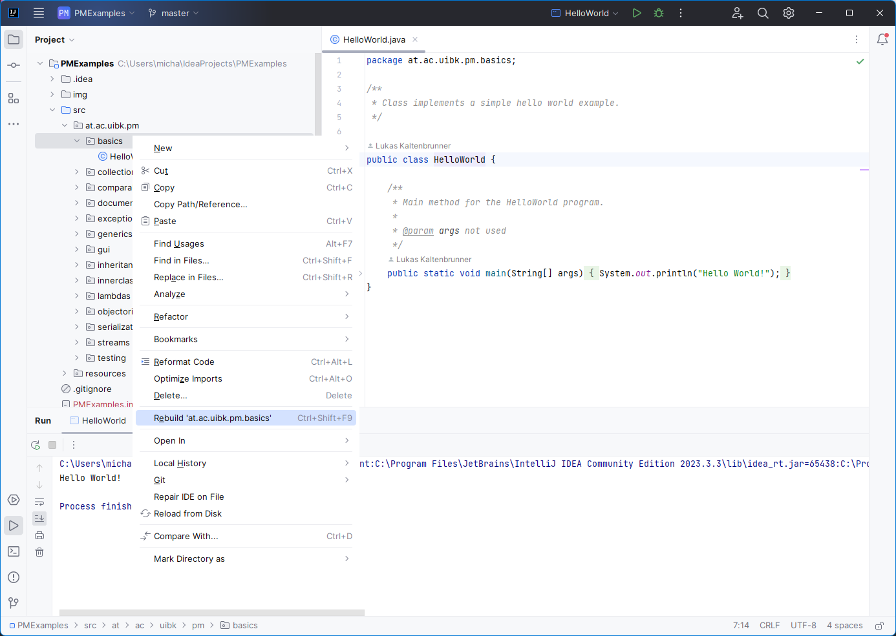
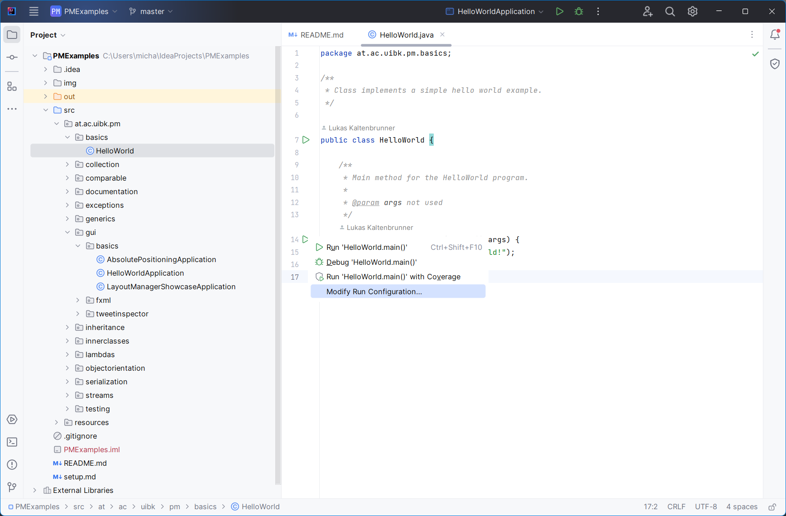
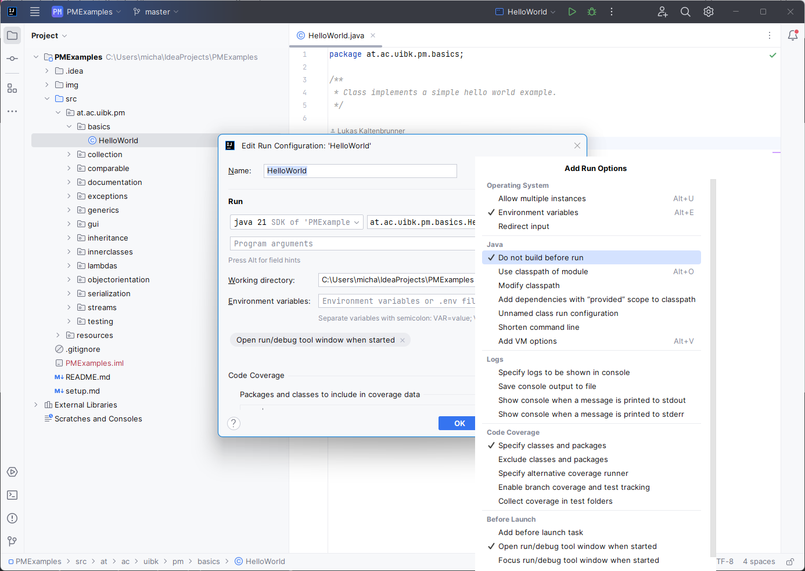
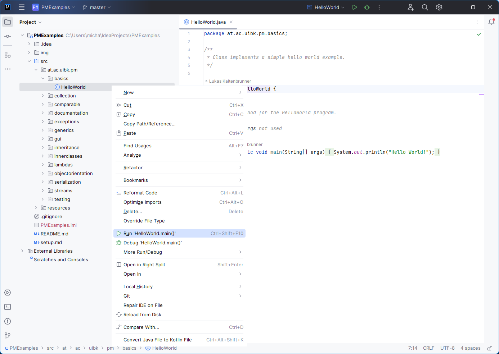
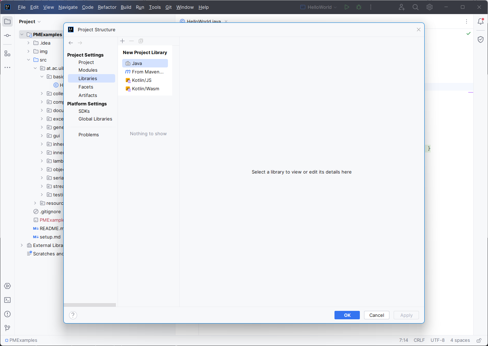
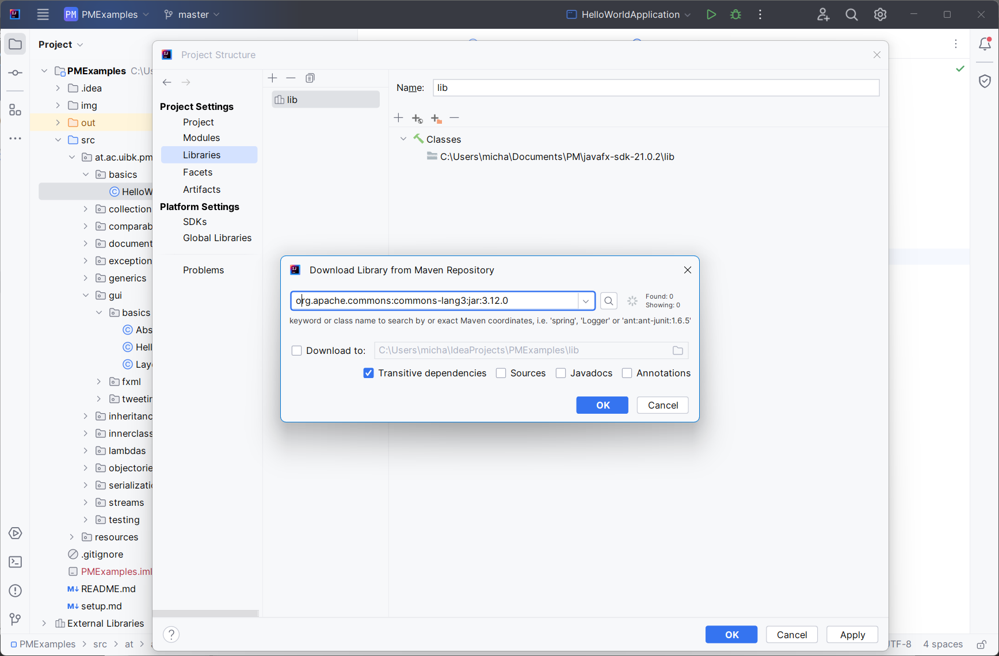

# Setup/run examples from PMExamples

[[_TOC_]]

## IntelliJ IDEA

### Run single example

By default, IntelliJ compiles the entire project before running a specific class. You can compile
single classes, or the content of selected packages by following the subsequent steps.

1. Navigate to the folder that contains the example you want to run. For the rest of this tutorial
   the `HelloWorld` is used as an example.
2. Make sure you selected the `basics` folder in the project explorer then go
   to `Build -> Rebuild '...at.ac.uibk.pm.basics'`.
    

        
    

3. Open the code file you want to run.
4. Right-click the arrow next to the `main` method.
5. Select `Modify Run Configuration ...`.
   

        
    

6. Click `Modify options` and select `Do not build before run`.
   

        
    

7. Close the dialogue `Edit Run Configuration: HelloWorld` by clicking `OK`.
8. Run the `HelloWorld`.
   

        
    

### Install all dependencies

Alternatively, all dependencies can be installed such that the entire project can be compiled
successfully. Therefore, enabling you to run every example.

1. Download your operating systems version of JavaFX 17 SDK
   from [https://openjfx.io/](https://openjfx.io/).
2. Move the downloaded archive to a location of your choice and extract it.
3. Open the PMExamples project in IntelliJ.
4. Go to `File -> Project Structure -> Libraries` and click the `+` (New Project Library).
   Select `Java`.
   

        
    

5. Point to the `lib` folder inside the previously extracted JavaFX 17 SDK, select `Open` and confirm
   the `Choose Modules` popup with `OK`.
6. Click `+` once more and choose `From Maven...`.
   Enter `org.apache.commons:commons-lang3:jar:3.12.0`, click with `OK` and confirm
   the `Choose Modules` popup with `OK`.
   

        
    

7. Repeat step 6 for
   - `com.google.code.gson:gson:jar:2.8.9`
   - `org.junit.jupiter:junit-jupiter:5.10.2`
8. All dependencies have been installed. You can now run every example in `PMExamples`.
